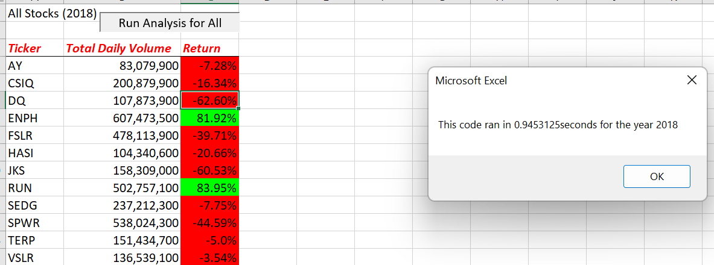
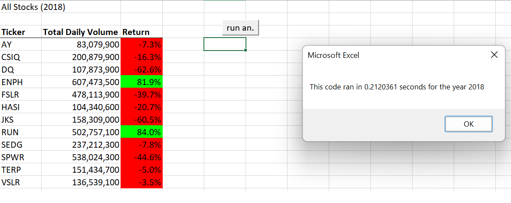

# **Stock Analysis For Steve**

## Overview 

According to our customer's needs, we have created an analysis sheet that has macros pre-programmed to show total volume and percentage of return on any given stock.  Steve can use this information at the click of a button, at which he'll be prompted to enter the year for his desired review.  He can use this to look over his parents' interests, or he can go further and broader for any stock ticker.  This is especially possible since we have refactored the code to be more efficient for larger data sets- so it also won't take so long to run, which is a major benefit.

## Results

At an initial glance, Steve (and also his parents) will be able to see that these green stocks have not been performing well in 2018, with the half of them showing decreased returns of around 40% or more in the year.  ENPH and RUN both are the exception with over 80% positive return, and both heavily traded in volumes over half a billion.  Steve might well be advised to consider broadening and diversifying any portfolio seeking to invest in this category of stocks.  In doing so, it may be helpful to note the refactored code in the second chart as it runs more efficiently, making it more capable of processing larger data sets and searches.

See the following summary table:

Compare with the following table done with refactored code:

## Analysis

Upon further comparison of the two versions of the same table above, the most important difference to note is the speed that the programming was timed at for reach table.  Once the user inputs the desired year, the clock measures the time to do all of the necessary formatting and data collection for output into the table in this readable format.  The first set of code does so with nested loops that take additional time to process.  The second does so with an index variable that guides multiple arrays as a reference. 

Overall, it seems that refactoring should always be in the mind of a good analyst and programmer in order to consider smoother, more elegant, and ultimately more user-friendly ways to complete necessary tasks.  The larger community benefits from the continued honing of solutions to problems which call for similar patterns.  Getting the job done is the bare minimum of a coding task.  Instead, the work continues as we truly seek automated processes that work better, but also ones that become more broadly useful to other settings as well.

